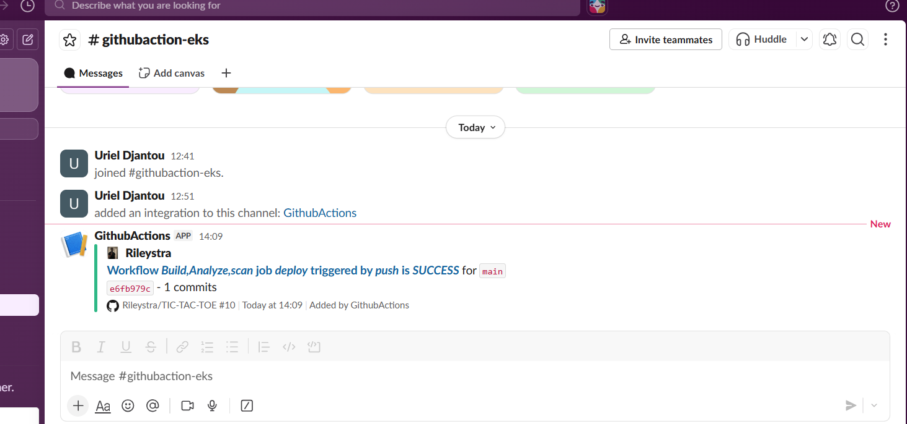
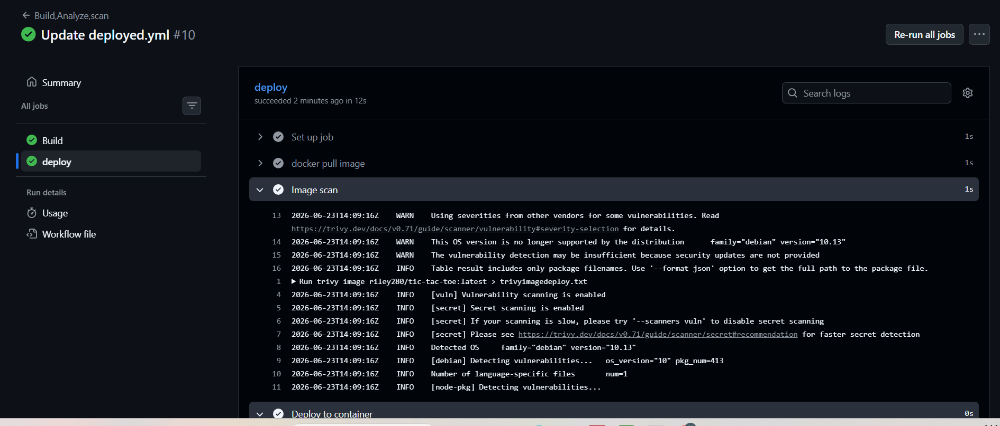
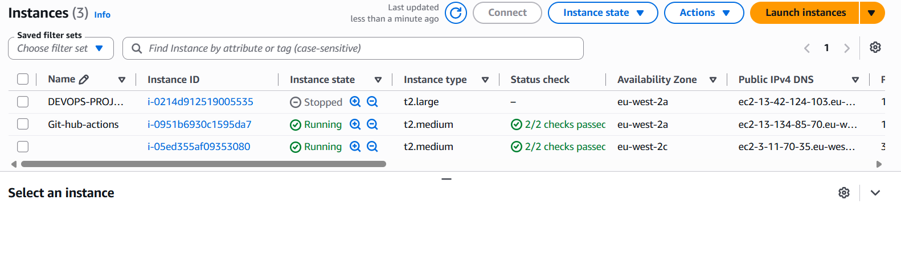
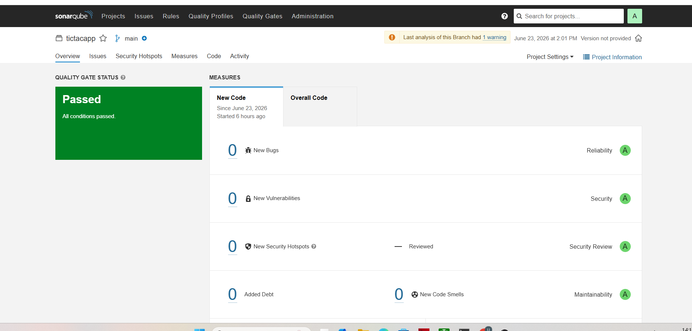
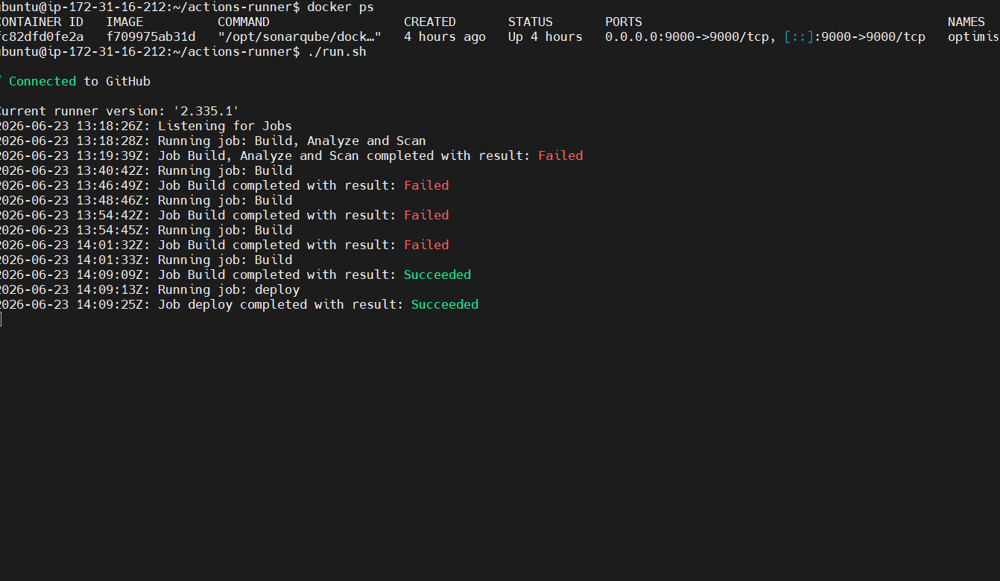
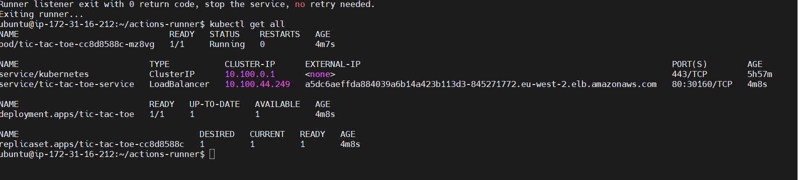
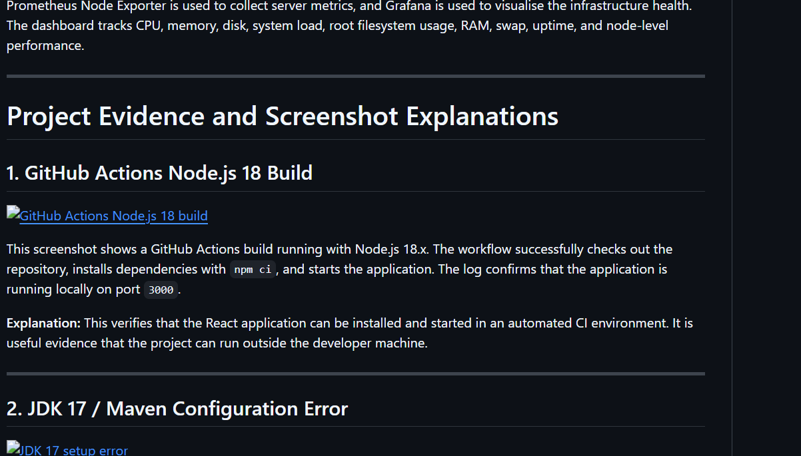

# Tic-Tac-Toe DevSecOps CI/CD Project

A React Tic-Tac-Toe application deployed through a DevSecOps pipeline using GitHub Actions, a self-hosted runner, Docker, SonarQube, Trivy, Slack notifications, AWS EC2, AWS EKS, Terraform, and Kubernetes.

This project demonstrates how a simple frontend application can be built, scanned, containerised, pushed to a container registry, and deployed to cloud infrastructure using an automated CI/CD workflow.

---

## Project Overview

The application is a Tic-Tac-Toe game built with React. The DevSecOps implementation adds automation around the application so that code changes pushed to the `main` branch can trigger build, quality analysis, container scanning, deployment, and Slack notification steps.

The project includes:

- A React frontend Tic-Tac-Toe game.
- Docker containerisation for consistent application runtime.
- GitHub Actions workflow automation.
- A self-hosted GitHub Actions runner running on an AWS EC2 instance.
- SonarQube analysis for code quality checks.
- Trivy scanning for filesystem and container-image vulnerabilities.
- Docker Hub image build and push.
- Kubernetes deployment using AWS EKS.
- Terraform files for EKS infrastructure provisioning.
- Slack integration for CI/CD status notifications.

---

## Technology Stack

| Area | Tools / Technologies |
|---|---|
| Frontend | React 18, JavaScript, CSS, Sass |
| Animation/UI | Framer Motion |
| Package Manager | npm |
| CI/CD | GitHub Actions |
| Runner | Self-hosted GitHub Actions runner on AWS EC2 |
| Code Quality | SonarQube |
| Security Scanning | Trivy filesystem scan and image scan |
| Containerisation | Docker |
| Registry | Docker Hub |
| Cloud | AWS EC2, AWS EKS |
| Infrastructure as Code | Terraform |
| Deployment | Kubernetes Deployment and LoadBalancer Service |
| Notifications | Slack GitHub Actions integration |

---

## DevSecOps Pipeline Flow

```mermaid
flowchart LR
    A[Developer Push to main] --> B[GitHub Actions Trigger]
    B --> C[Self-hosted Runner]
    C --> D[Checkout Code]
    D --> E[SonarQube Analysis]
    E --> F[Install Dependencies]
    F --> G[Trivy Filesystem Scan]
    G --> H[Docker Build]
    H --> I[Docker Hub Push]
    I --> J[Trivy Image Scan]
    J --> K[Deploy Container]
    K --> L[Update EKS kubeconfig]
    L --> M[Deploy to Kubernetes]
    M --> N[Slack Notification]
```



---

## Repository Structure

```text
.
├── .github/
│   └── workflows/
│       └── deployed.yml
├── Eks-terraform/
│   ├── backend.tf
│   ├── main.tf
│   └── provider.tf
├── public/
├── src/
│   ├── components/
│   │   ├── Button.jsx
│   │   ├── Square.jsx
│   │   └── Square.scss
│   ├── App.js
│   ├── index.css
│   └── index.js
├── docs/
│   └── images/
├── Dockerfile
├── Eks.yml
├── deployment-service.yml
├── package.json
├── script.sh
├── sonar-project.properties
└── README.md
```

---

## Local Development Setup

### 1. Clone the repository

```bash
git clone <your-github-repository-url>
cd TIC-TAC-TOE-main
```

### 2. Install dependencies

```bash
npm install
```

### 3. Start the application

```bash
npm start
```

The application runs locally on:

```text
http://localhost:3000
```

### 4. Build the application

```bash
npm run build
```

---

## Docker Build and Run

Build the Docker image:

```bash
docker build -t tic-tac-toe .
```

Run the application container:

```bash
docker run -d --name game -p 3000:3000 tic-tac-toe
```

Open the application in the browser:

```text
http://localhost:3000
```

---

## GitHub Actions Pipeline Summary

The GitHub Actions workflow is triggered when code is pushed to the `main` branch.

Main pipeline actions include:

1. Checkout source code from GitHub.
2. Run SonarQube code analysis.
3. Install project dependencies.
4. Run Trivy filesystem security scan.
5. Build the Docker image.
6. Tag and push the image to Docker Hub.
7. Pull the image during the deploy job.
8. Run Trivy image scan against the container image.
9. Deploy the application to a Docker container.
10. Update the kubeconfig for the EKS cluster.
11. Deploy the Kubernetes manifest.
12. Send a Slack notification with the job status.

Required GitHub repository secrets:

```text
SONAR_TOKEN
SONAR_HOST_URL
DOCKERHUB_USERNAME
DOCKERHUB_TOKEN
SLACK_WEBHOOK_URL
AWS_ACCESS_KEY_ID
AWS_SECRET_ACCESS_KEY
```

---

## SonarQube Configuration

The project contains a `sonar-project.properties` file:

```properties
sonar.projectKey=tictacapp
```

SonarQube is used to check code quality, reliability, maintainability, security, and quality gate status before the deployment process continues.

---

## Trivy Security Scanning

Trivy is used for security scanning in two places:

### Filesystem scan

```bash
trivy fs . > trivyfs.txt
```

This checks the source code and dependency files for known vulnerabilities and security issues.

### Docker image scan

```bash
trivy image <dockerhub-username>/tic-tac-toe:latest > trivyimage.txt
```

This checks the built Docker image before or during deployment.

---

## Kubernetes Deployment on AWS EKS

The Kubernetes deployment is defined in `deployment-service.yml`.

It creates:

- A Kubernetes `Deployment` named `tic-tac-toe`.
- One running replica of the application pod.
- A `LoadBalancer` service named `tic-tac-toe-service`.
- External access through an AWS Elastic Load Balancer DNS endpoint.

Deploy manually with:

```bash
aws eks --region <your-region> update-kubeconfig --name EKS_CLOUD
kubectl apply -f deployment-service.yml
kubectl get all
```

---

## Terraform EKS Infrastructure

The `Eks-terraform` folder contains Terraform configuration for creating the AWS EKS cluster and node group.

The Terraform files define:

- AWS provider configuration.
- EKS cluster IAM role.
- EKS cluster resource.
- Worker node IAM role.
- EKS managed node group.
- S3 backend configuration for Terraform state.

Typical Terraform commands:

```bash
cd Eks-terraform
terraform init
terraform plan
terraform apply
```

---

## Slack Notification Integration

Slack is connected to the GitHub Actions workflow. When the pipeline completes, the workflow posts a message into the configured Slack channel with the workflow name, status, branch, commit, and repository link.

This makes the deployment process visible to the team without needing to manually open GitHub Actions after every push.

---

# Project Evidence and Screenshot Explanations

## 1. Slack Notification for Successful GitHub Actions Workflow



This screenshot shows the `#githubaction-eks` Slack channel receiving a message from the GitHub Actions integration. The workflow `Build,Analyze,scan` was triggered by a push to the `main` branch and completed successfully.

**Explanation:** This proves that Slack notifications are integrated with the CI/CD pipeline. It also confirms that the pipeline status is automatically reported to the team after a GitHub push.

---

## 2. GitHub Actions Deploy Job with Trivy Image Scan



This screenshot shows GitHub Actions run `#10` for the `Update deployed.yml` workflow. Both the `Build` and `deploy` jobs completed successfully. The deploy job includes steps for pulling the Docker image, scanning it with Trivy, and deploying the application.

**Explanation:** This verifies that the deployment stage is automated and that a container image scan is included before deployment. The Trivy output shows vulnerability and secret scanning enabled for the Docker image.

---

## 3. AWS EC2 Instances for CI/CD and Cloud Infrastructure



This screenshot shows AWS EC2 instances used for the project environment. Two instances are running and passing status checks, while one instance is stopped. The running machines are used to support the GitHub Actions self-hosted runner and cloud infrastructure tasks.

**Explanation:** This demonstrates that the CI/CD environment is running on AWS infrastructure. The healthy EC2 status checks confirm that the cloud instances required for the pipeline are available.

---

## 4. SonarQube Quality Gate Passed



This screenshot shows the SonarQube dashboard for the `tictacapp` project. The quality gate status is `Passed`, with no new bugs, no new vulnerabilities, no new security hotspots, and no new code smells shown for the analysed code.

**Explanation:** This confirms that SonarQube analysis is working and that the project passed the configured code quality checks. It provides evidence that code quality and maintainability are included in the DevSecOps pipeline.

---

## 5. Self-hosted GitHub Actions Runner Connected to GitHub



This screenshot shows the self-hosted runner connected to GitHub and listening for jobs. It also shows several build attempts, followed by successful `Build` and `deploy` job completions. The terminal also shows a SonarQube Docker container running on port `9000`.

**Explanation:** This proves that the GitHub Actions workflow is not running only on GitHub-hosted runners. It is connected to a self-hosted runner where Docker, SonarQube, AWS CLI, Trivy, and Kubernetes tools can be installed and controlled directly.

---

## 6. Kubernetes Deployment Running on AWS EKS



This screenshot shows the output of `kubectl get all`. The Tic-Tac-Toe pod is running, the deployment is available with `1/1` replicas, the ReplicaSet is ready, and the `tic-tac-toe-service` is exposed using a `LoadBalancer` with an external AWS ELB DNS name.

**Explanation:** This confirms that the application was deployed successfully to Kubernetes on AWS EKS. The LoadBalancer service provides external access to the application through AWS.

---

## 7. README Documentation Layout Reference



This screenshot shows the documentation style used for presenting project evidence and screenshot explanations in a GitHub README.

**Explanation:** It is included as a reference for the structure of the evidence section: each screenshot is displayed with a title, followed by a clear explanation of what the screenshot proves in the DevSecOps workflow.

---

## Notes for Future Improvement

- Keep Docker Hub image names consistent across workflow files and Kubernetes manifests.
- Use GitHub secrets for all tokens and credentials instead of hard-coding them in scripts.
- Rotate any token that has been committed to the repository history.
- Use `kubectl apply -f deployment-service.yml` for deployment updates.
- Store Trivy scan outputs as GitHub Actions artifacts for audit evidence.
- Add branch protection so deployment runs only after successful checks.

---

## Author

**Uriel Djantou**

DevOps / DevSecOps project demonstrating CI/CD, containerisation, security scanning, code quality analysis, and Kubernetes deployment on AWS.
